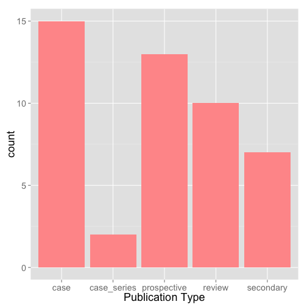

## Goals of Research Group

1. Increase productivity of researchers in department
2. Provide opportunities for new/current department members to perform research
3. Develop knowledge base of research resources at Tripler

--- .class #id 

## Publication Productivity

Survey of department in late 2014

PubMed "Tripler Pediatrics" (2013-)
Google Scholar "Tripler Pediatrics" (2013-)

[Link to Publication Bibliography](publications.html)

---

## Breakdown of Research Type

 

---

## Participation by Residents


```r
ggplot(data=dat, aes(x=type, fill = resident)) + 
    geom_bar(stat="bin") + xlab("Publication Type")
```

 

---

## Divisions Involved in Research


```r
ggplot(data=dat, aes(x=division)) + 
    geom_bar(fill="#FF9999", stat="bin") + xlab("Publication Type")
```

 

---

## Posters/Presentations

